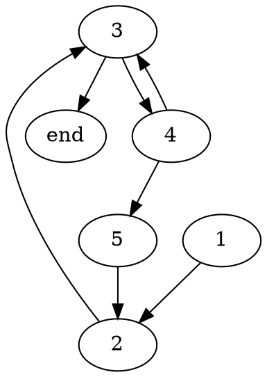
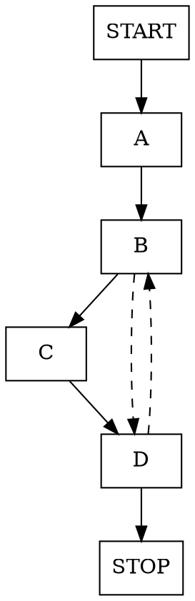
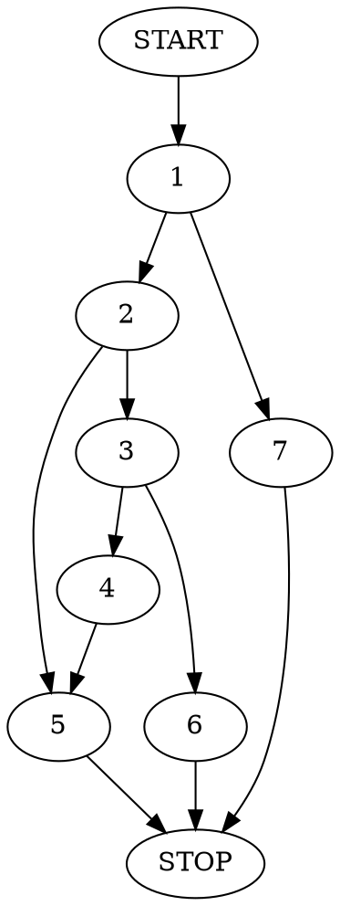

# Ćwiczenia 5 z ASK, grupa AKr

## Lista ćwiczeniowa 5 (09.04.2020)

### Zadanie 1

:::info
Zaimplementuj funkcję zdefiniowaną poniżej w asemblerze ```x86-64```. Taka procedura w języku ```C``` miałaby sygnaturę ```long cmp(uint64_t x, uint64_t y)```.
  $$
    cmp(x,y) = 
    \begin{cases}
      -1 & \text{gdy } x < y \\
      \phantom{+}1 & \text{gdy } x > y \\
      \phantom{+}0 & \text{gdy } x = y \\
    \end{cases}
  $$
  Wskazówka: Rozwiązanie wzorcowe ma cztery wiersze (bez ```ret```). Użyj  instrukcji ```adc```, ```sbb``` i ```neg```.
:::


```
neg D    - arithmetic negation      (D = -D)           (modyfikuje CF)       
sbb S, D - substract with borrow    (D = D - (S +CF))  (modyfikuje CF) 
adc S, D - add with carry           (D = D + S + CF)   (modyfikuje CF) 
```
```
Parametry funkcji:
x -> %rdi 
y -> %rsi 
Wynik zwracamy w %rax
```

```scala=
cmp:
    subq  %rsi, %rdi   // x - y; CF = 1 dla x < y
    sbbq  %rax, %rax   // rax = -1 dla x < y
                       // wpp. rax = 0
    negq  %rdi         // x = 0 - (x-y); 
                       // CF = 1 dla x > y lub x < y
    adcq  %rax, %rax   // x < y : rax = -1
                       // x == y : rax = 0
                       // x > y : rax = 1
    ret 
```


### Zadanie 2


:::info
Poniżej zamieszczono kod procedury o sygnaturze «long puzzle2(char *s, char *d)». Wyznacz bloki podstawowe oraz narysuj graf przepływu sterowania. Przetłumacz tę procedurę na język C, a następnie jednym zdaniem powiedz co ona robi.
```=
puzzle2:
  movq %rdi, %rax
.L3: 
  movb (%rax), %r9b
  leaq 1(%rax), %r8
  movq %rsi, %rdx
.L2: 
  movb (%rdx), %cl
  incq %rdx
  testb %cl, %cl
  je .L4
  cmpb %cl, %r9b
  jne .L2
  movq %r8, %rax
  jmp .L3
.L4: 
  subq %rdi, %rax
  ret
```
:::


Zauważmy, że s i d to są tablice typu char. Nasza procedura iteruje się po tablicy s, sprawdzając po kolei, czy jej elementy należą również do d. Jeśli napotka element z s , który nie należy do d, procedura kończy działanie i zwraca liczbę pierwszych elementów z s należących do d.

Tabelka zmiennych dla poniższego kodu:
|Zmienna    |Rejestr    |
|-----------|-----------|
|s          |%rdi       |
|d          |%rsi       |
|temp_s     |%rax       |
|temp_d     |%rdx       |
|s_znak     |%r9b       |
|d_znak     |%cl        |
|s_next     |%r8        |

Wersja z goto:

```C=
long puzzle2_goto(char* s,char* d)
{
    char* temp_s = s; char s_znak,d_znak; char* s_next; char* temp_d; // 1
    L3:
        s_znak = *temp_s;// 2
        s_next = temp_s+1;
        temp_d = d;
    L2:
        d_znak = *temp_d; // 3
        temp_d = temp_d+1;
        if (d_znak == 0) return temp_s-s; // end - sprawdzamy czy koniec tablicy d
        if (d_znak != s_znak) goto L2; //4
        else{ // 5 
            temp_s = s_next;
            goto L3;
        }
}
```
Dla przypomnienia:
- blok podstawowy - grupa instrukcji zakończona instrukcją skoku
- graf przepływu sterowania - graf skierowany, w którym wierzchołkami są bloki podstawowe - reprezentuje możliwe ścieżki działanie programu

Graf przepływu sterowania (bloki podstawowe oznaczone w komentarzach powyżej):

Kod w C bez goto:
```C=
long puzzle2_normal(char *s,char *d)
{
    char* temp_s=s;
    char* temp_d;
    while (1)
    {
        temp_d = d;
        while (*temp_d != *temp_s)
        {
            if (*temp_d == 0)  return temp_s-s;
            temp_d++;
        }
        temp_s++;
    }
}
```
### Zadanie 3


:::info
Poniżej widnieje kod funkcji o sygnaturze «uint32_t puzzle3(uint32_t n, uint32_t d)». Wyznacz bloki podstawowe oraz narysuj graf przepływu sterowania, po czym przetłumacz tę funkcję na język C. Na podstawie ustępu „Mixing C and Assembly Language” strony GNU Assembler Examples3 napisz program, który pomoże Ci powiedzieć co ta funkcja robi.
```=
 puzzle3:
   movl %edi, %edi          
   salq $32, %rsi
   movl $32, %edx
   movl $0x80000000, %ecx
   xorl %eax, %eax
   
 .L3: 
   addq %rdi, %rdi         
   movq %rdi, %r8
   subq %rsi, %r8
   js .L2 
   
   orl %ecx, %eax         
   movq %r8, %rdi
   
 .L2: 
   shrl %ecx             
   decl %edx
   jne .L3
   ret
```
:::


```=
.global _start
.global puzzle3

.text

 puzzle3:
   movl %edi, %edi            //A
   salq $32, %rsi
   movl $32, %edx
   movl $0x80000000, %ecx
   xorl %eax, %eax
   
   .L3: addq %rdi, %rdi       //B
   movq %rdi, %r8
   subq %rsi, %r8
   js .L2
   
   orl %ecx, %eax             //C
   movq %r8, %rdi
   
   .L2: shrl %ecx             //D
   decl %edx
   jne .L3
   ret
   
_start:
    call puzzle3
    syscall
```



```
Parametry funkcji:
n -> %edi
d -> %esi

Zmienne:
x -> %rsi
m -> %rdi
a -> %edx
b -> %ecx
result -> %eax
```


```C=
uint32_t puzzle3(uint32_t n, uint32_t d)
{
    int64_t x = d << 32;
    int32_t a = 32;
    int64_t b = 0x80000000;
    int32_t result = 0;
    int64_t m = n;
    
    while(a>=0)
    {
        m*=2;

        if (m - x >= 0)
        {
            result = b | result;
            m -= x;
        }
        b /= 2;
        a -= 1;
    }

    return result;
}
```

Ten algorytm to restoring division (n przez d).

### Zadanie 4


:::info
Poniżej zamieszczono kod rekurencyjnej procedury o sygnaturze «int puzzle4(long *a, long v, uint64_t s, uint64_t e)». Wyznacz bloki podstawowe oraz narysuj graf przepływu sterowania. Przetłumacz tę procedurę na język C, a następnie jednym zdaniem powiedz co ona robi.
```=
 puzzle4:
   movq %rcx, %rax
   subq %rdx, %rax
   shrq %rax
   addq %rdx, %rax
   cmpq %rdx, %rcx
   jb .L5
   movq (%rdi,%rax,8), %r8
   cmpq %rsi, %r8
   je .L10
   cmpq %rsi, %r8
   jg .L11
   leaq 1(%rax), %rdx
   call puzzle4
 .L10: 
   ret
 .L11: 
   leaq -1(%rax), %rcx
   call puzzle4
   ret
 .L5: 
   movl $-1, %eax
   ret
```
Wskazówka: Z reguły procedurę «puzzle4» woła się następująco: «i = puzzle4(a, v, 0, n - 1)»
:::

```
puzzle4:
    movq %rcx, %rax            //1
    subq %rdx, %rax
    shrq %rax
    addq %rdx, %rax
    cmpq %rdx, %rcx
    jb .L5
    
    movq (%rdi,%rax,8), %r8     // 2
      cmpq %rsi, %r8
      je .L10
      
      cmpq %rsi, %r8            // 3
      jg .L11
      
      leaq 1(%rax), %rdx        // 4
      call puzzle4
      
.L10: ret                       // 5

.L11: leaq -1(%rax), %rcx       // 6
      call puzzle4
      ret                       
      
.L5: movl $-1, %eax             // 7
     ret
     
``` 

puzzle4: BinarySearch

s (początek tablicy)- rdx
e (koniec tablicy)- rcx
a (tablica)- rdi
v (szukana wartość)- rsi
```c=
int puzzle4(long *a,long v, uint64_t s, uint64_t e) 
{ 
    if (e >= s) { 
        int mid = s + (e - s) / 2; 
  
        if (a[mid] == v) 
            return mid; 

        if (a[mid] > v) 
            return puzzle4(a, v, s, mid - 1); 

        return puzzle4(a, v, mid + 1, e); 
    } 

    return -1; 
} 
```


### Zadanie 5


:::info
Poniższy kod w asemblerze otrzymano w wyniku deasemblacji funkcji zadeklarowanej jako «long switch_prob(long x, long n)». Zapisz w języku C kod odpowiadający tej funkcji.
```
400590 <switch_prob>:
400590: 48 83                     subq $0x3c,%rsi
400594: 48 83 fe 05               cmpq $0x5,%rsi
400598: 77 29                     ja *0x4005c3
40059a: ff 24 f5 f8 06 40 00      jmpq *0x4006f8(,%rsi,8)
4005a1: 48 8d 04 fd 00 00 00 00   lea 0x0(,%rdi,8),%rax
4005a9: c3                        retq
4005aa: 48 89 f8                  movq %rdi,%rax
4005ad: 48 c1 f8 03               sarq $0x3,%rax
4005b1: c3                        retq
4005b2: 48 89 f8                  movq %rdi,%rax
4005b5: 48 c1 e0 04               shlq $0x4,%rax
4005b9: 48 29 f8                  subq %rdi,%rax
4005bc: 48 89 c7                  movq %rax,%rdi
4005bf: 48 0f af ff               imulq %rdi,%rdi
4005c3: 48 8d 47 4b               leaq 0x4b(%rdi),%rax
4005c7: c3                        retq
```

Zrzut pamięci przechowującej tablicę skoków:
```
(gdb) x/6gx 0x4006f8
0x4006f8: 0x4005a1
0x400700: 0x4005a1
0x400708: 0x4005b2
0x400710: 0x4005c3
0x400718: 0x4005aa
0x400720: 0x4005bf
```
:::

```c=
long switch_prob(long x, long n){
    n-=0x3c;
    switch(n){
        case 0:
        case 1:
            return 8*x;
        case 4:
            return x<<3;
        case 2:
            x*=15;
        case 5:
            x*=x;
        case 3:
        default:
            return x+0x4b;
        }
}
```

### Zadanie 6


:::info
Poniżej zamieszczono kod procedury o sygnaturze «struct T puzzle8(long *a, long n)». Na jego podstawie podaj definicję typu «struct T». Przetłumacz tę procedurę na język C, po czym jednym zdaniem powiedz co ona robi. Gdyby sygnatura procedury nie była wcześniej znana to jaką należałoby wywnioskować z poniższego kodu?
```=
puzzle8:
  movq %rdx, %r11
  xorl %r10d, %r10d
  xorl %eax, %eax
  movq $LONG_MIN, %r8
  movq $LONG_MAX, %r9
.L2: 
  cmpq %r11, %r10
  jge .L5
  movq (%rsi,%r10,8), %rcx
  cmpq %rcx, %r9
  cmovg %rcx, %r9
  cmpq %rcx, %r8
  cmovl %rcx, %r8
  addq %rcx, %rax
  incq %r10
  jmp .L2
.L5: 
  cqto
  movq %r9, (%rdi)
  idivq %r11
  movq %r8, 8(%rdi)
  movq %rax, 16(%rdi)
  movq %rdi, %rax
  ret
```
Wskazówka: Zauważ, że wynik procedury nie mieści się w rejestrach %rax i %rdx, zatem zostanie umieszczony w pamięci.
:::


```
Argumenty funkcji:
struct *T        -> %rdi (wskaźnik na miejsce na strukturę)
long   *a        -> %rsi (wskaźnik na tablicę)
long    n        -> %rdx (długość tablicy)
Zmienne:   
int     i        -> %r10d
long   sum       -> %rax
long   max       -> %r8
long   min       -> %r9
long  value      -> &rcx
long average     -> %r11
struct *T result -> %rax (zwracany wskaźnik na miejsce w pamięci, w którym
                          zapisaliśmy wynik)
```
Warto zauważyć, że sum zostaje zapisana do %rax.
Dzieje się tak, gdyż kilka linii później wywołujemy instrukcję idiv, która 
aby wykonać dzielenie korzysta właśnie z tego rejestru.
```
cqto    - instrukcja rozszerza %rax do %rdx:%rax (tak, że wartość 
          z %rax zachowuje znak)

idivq S - dzielenie ze znakiem %rdx : %rax przez S, gdzie
          %rdx - wynik dzielenia całkowitego 
          %rax - reszta z dzielenia
```
Widzimy również, że wyniki z naszej funkcji (max, min, sum) zapisujemy 
pod adresem przechowanym w %rdi przesuniętym o odpowiednią ilość bajtów,
tak, by adres odpowiadał konkretnemu polu w strukturze. Nie przekazaliśmy
tego adresu jawnie jako parametr w funkcji, ale dostaliśmy go wraz z jej wywołaniem.

(Chcąc wywołać tą funkcję w assemblerze musielibyśmy najpierw zadbać o to,
by dostała wskaźnik na miejsce w pamięci w której ma zapisać utworzoną strukturę.)

```c=
struct T 
{
    long min;
    long max;
    long average;
}

struct T puzzle8(long *a, long n)
{
    long sum = 0;                //4
    long max  = LONG_MIN;        //5 (r8)
    long min  = LONG_MAX;        //6 (r9)
    for(int i = 0; i < n; i++)   //3, 7, 8, 16
    {
        long value = a[i];       //10
        if(min > value)          //11 (r9 > val)
            min = value;         //12 
        if(max < value)          //13 (r8 < val)
            max = value;         //14
        sum += value;            //15
    }                            //17
    //19 cqto - przygotowuje rdx pod dzielenie
    long average = sum/n;        //2, 21
    struct T result;
    result.min = min;            //20 
    result.max = max;            //22 
    result.average = average;    //23
    return result;               //25
}

```

Wnioskowanie dotyczące sygnatury: linie 20-22 wskazują, że zapisujemy do miejsc wskazanych przez %rdi i offset, a zwracamy rdi. Argumentami funkcji jest wartosc n (linie 2 i 19) i adres wskazany przez a (linia 9).
Możliwe by było wywnioskowanie sygnatury:
```
void* puzzle8(struct* T result, long *a, long n )
```
gdzie wynikiem jest result.

Zatem chociaż w kodzie "zwracamy strukturę" to w rzeczywistości, ponieważ nie mieści się na rejestrze %rdx:%rax, zapisujemy ją w pamięci i zwracamy wskaźnik na nią.

Jeśli chodzi o działanie funkcji to przyjmuje ona tablicę ```a``` typu ```long``` oraz jej długość ```n```, zaś zwraca strukturę przechowującą informacje o liczbie najmniejszej, największej i średniej wszystkich elementów.


|Dla poniższych zadań należy podać kompletny algorytm, zatem dozwolona jest cała składnia języka C bez ograniczeń z nagłówka listy zadań. Jednakże należy używać wyłącznie operacji na typie «int32_t» lub «uint32_t».|
|-|

### Zadanie 7 z listy 3


:::info
Uzupełnij ciało poniższej procedury konwertującej wartość całkowitoliczbową do binarnej reprezentacji liczby typu «float». Wynik należy zaokrąglić do najbliższej liczby parzystej – w tym celuwyznacz wartość bitów guard, round i sticky. Do wyznaczenia pozycji wiodącej jedynki można użyć funkcji «__builtin_clz», tj. instrukcji wbudowanej1 w kompilator gcc.
```cpp
int32_t int2float(int32_t i) {
   /* TODO */
}
```
:::


```c=
int32_t int2float(int32_t i) {

    /*
    przykład: int32_t =  00000000000000000000000101011101  =
    = 2^8 + 2^6 + 2^4 + 2^3 + 2^2 + 2^0 = 2^8 (1 + 2^-2 + 2^-4 + 2^-5 + 2^-6 + 2^-8) =
    = 2^8 * 1.01011101  
    czyli: 
        e = 8 + 127 (trzeba uwzględnić bias)
        m = 1.01011101 
        s = 0

    kolejny przykład -127 = -1 * (2^6 + 2^5 + 2^4 + 2^3 + 2^2 + 2^1 + 2^0) = 
    = -1 * 1.111111 * 2^6 (czyli przesunięcie bitowe o 6 w lewo) 
    */

    /* znak - sign: 
    -1 jeśli znak był ujemny */
    int32_t s = i >> 31; 

    /* jesli i jest ujemna to otrzymaliśmy już znak,
    a chcemy znaleźć wiodącą jedynkę, która nie oznacza znaku */
    if (s == -1) {
        i = -i;    // usuwamy jedynkę z początkowego bitu
        s = 1;
    }

    /* pozycja:
    __builtin_clz zwraca liczbę zer wiodących
    więc mozemy policzyć pozycje wiodącej jedynki (od prawej)
    odejmując od 32 wynik __builtin_clz(i) */
    int32_t p = 32 - __builtin_clz(i);

    /* wykładnik - exponent: 
    po odjęciu 1 (bo chcemy numerować bity od 0, by i-ty bit oznaczał 2^i w sumie)
    i dodaniu bias (obliczając wykładnik trzeba go odejmować)
    mamy nasz wykładnik */
    int32_t bias = 127;
    int32_t e = p - 1 + bias;   

    /* tworzymy maskę, aby wyeliminować wiodącą jedynkę, aby mieć tylko mantysę
    więc przesuwamy 1 na pozycję p i wtedy odejmujemy 1, aby na prawo od p były same 1*/
    int32_t mask = (1<<(p-1))-1;

    /* eliminujemy wiodącą jedynkę */
    i &= mask; 

    /* guard, round i sticky 
    potrzebne nam będą do zaokrąglenia round-to-even */
    int32_t 
        guard  = 0,
        round  = 0,
        sticky = 0; 

    /* zaokrąglamy, gdy pozycja p jest większa niż 23, 
    ponieważ na prawo od niej znajduje się wtedy za dużo bitów na mantysę */
    if (p > 24) {
        /* ostatni bit mantysy jest na pozycji 23 na prawo od p ( p - 23 ) 
        więc jeśli chcemy dostać się do tego bitu to przesuniemy o (p - 23) - 1 
        bo aby dostać się do bitu k-tego na prawo, przesuwamy o k-1 w prawo */
        guard  = ( i >> (p - 23 - 1) ) & 1;
        /* bit round jest o 1 w prawo od bitu guard */
        round  = ( i >> (p - 23 - 2) ) & 1;
        /* sticky bit to OR bitów na prawo od round 
        więc 1 przesuwamy na pozycję round i odejmujemy 1
        więc aby wziąć OR, wystarczy sprawdzić czy liczba jest większa od 0*/
        sticky = ( i & ( ( 1 << (p - 23 - 2) ) - 1 ) ) > 0; 
    }

    /* mantysa - fraction:
    chcemy, aby miejsce wiodącej jedynki znajdowało się na 24 pozycji od prawej,
    aby na najmniej znaczących 23 bitach znajdowała się mantysa
    musimy dosunąć 
        w lewo o tyle ile brakuje nam do 24 pozycji (jeśli p < 24)
        w prawo o tyle ile jesteśmy za daleko do 24 pozycji (jeśli p >= 24) */
    int32_t f = 
        ( p < 24 ? (i << (24 - p)) : (i >> (p - 24)) ) + 
        ((guard & round) | (round & sticky)) ;

    return (s << 31) + (e << 23) + f ;
}
```
### Zadanie 8 z listy 3

:::info
Uzupełnij ciało poniższej procedury konwertującej binarną reprezentację liczby typu «float» umieszczoną w zmiennej «f» do wartości typu «int32_t». Wynik należy zaokrąglić w kierunku zera. Jeśli konwersja spowoduje nadmiar lub f ma wartość NaN, zwróć wartość 0x80000000 (tj. MIN_INT). Kod procedury zaczyna się wyodrębnieniem poszczególnych elementów liczby zmiennopozycyjnej:
```cpp
int32_t float2int(int32_t f) {
   int32_t s = f >> 31; /* -1 jeśli znak był ujemny */
   int32_t e = (f >> 23 & 255) - 127; /* wykładnik po odjęciu bias */
   uint32_t m = f << 8 | 0x80000000; /* mantysa 1.xxx... dosunięta do lewej */
   /* TODO */
}
```
Wskazówka: Wzorcówka ma dodatkowe cztery linie kodu i używa jednej instrukcji warunkowej!
:::

```cpp
int32_t float2int(int32_t f)
{
    int32_t s = (f >> 31)|1; // -1 jeśli znak był ujemny 
    int32_t e = (f >> 23 & 255) - 127; // wykładnik po odjęciu bias 
    uint32_t m = f << 8 | 0x80000000; // mantysa 1.xxx... dosunięta do lewej 
    
    if(e > 30) 
        return 0x80000000; //dla Nan, dużych liczb lub MIN_INT
        
    if(e < 0) 
        return 0; // dla małych liczb
        
    // s*=(e>=0);
        
    return s * (m >> (31-e));
}
```

